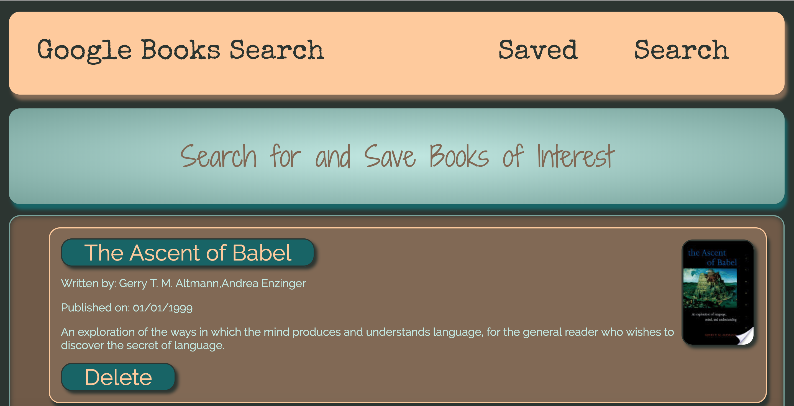

#  Google Books Search

## *Share in a community reading list*

### The following collaborative project is a web application that provides an aesthetically-pleasing User Interface to search for books and add them to a community list. This community list provides an opportunity to be exposed to books you may not have thought to read before, as well as allow you to expose others to your interests!

We employed HTML, CSS, SASS, JavaScript, Yarn, and React.js to make this application. All of the task-specific React components are rendered when each page loads and when the Class 'states' change. The Class states track the books returned from a query to the Google Books API, the title of the book inputted into the query field, and the action-specific messages displayed to provide users feedback about the application's functioning. When the 'books' state is populated by the response from the Google Books API, each book relevant to the query displays on the page. The user can click on the title to open the book on Google Books, see the cover photo of the book, see the authors of the book, see the published date, and read a short synopsis, all in one location. The user then has the option to save the book to the community list, visit the community list, and delete books from the list, should they choose to.

### Usage:

* Visit the link to the deployed application at the bottom of this README, or at the top of the GitHub page

* Type in the title of a book and click "Search"
    * Peruse the results and visit the Google Books pages for each title returned if desired
    * Add a book to the "Saved" page (community list) by clicking on the "Save" button
    * After clicking the "Save" button, you will be automatically redirected to the community list
* To see what's already on the community list, click on the "Saved" tab at the top of the page. Peruse the saved books and see what inspires you!

## 

 React's Component-based, functional programming allows web developers to minimize the amount of work each file does, making the application more efficient, easily editable, and making live updates possible. In this application, We utilized ECMA6 classes to define components that render specific snippets of HTML and JavaScript. The Saved and Search components responsible for rendering all of the sub-components also handle the logic of displaying the book information, saving books to the community list, and deleting books from the community list. This is accomplished by using the object 'state' to track data and pass props to the corresponding sub-components:

 ``` javascript
class Search extends Component {
    state = {
        books: [],
        title: "",
        errorMessage: "Type in the title of a book you'd like to read!"
    };
    loadBooks = (data) => {
        let objBooks = { books: [] };
        for (let i = 0; i < data.length; i++) {
            if (data[i].volumeInfo.imageLinks) {
                let item = {
                    id: data[i].id,
                    title: data[i].volumeInfo.title,
                    authors: data[i].volumeInfo.authors,
                    publishedDate: data[i].volumeInfo.publishedDate,
                    description: data[i].volumeInfo.description,
                    image: data[i].volumeInfo.imageLinks.thumbnail,
                    link: data[i].volumeInfo.previewLink,
                }
                objBooks.books.push(item)
            }
        }
        this.setState({ books: objBooks.books, title: "" })
    };
    handleInputChange = event => {
        const { name, value } = event.target;
        this.setState({
            [name]: value
        });
    };
    handleSearchSubmit = event => {
        event.preventDefault();
        if (this.state.title) {
            API.getBooksGoo(this.state.title)
                .then(res => {
                    this.loadBooks(res.data.items);
                })
                .catch(err => {
                    console.log(err)
                    this.setState({
                        errorMessage: "Oh No! We couldn't find any books related to your query!"
                    });
                });
        }
    };
    handleSaveBook = id => {
        const savedBook = this.state.books.filter(book => book.id === id)
        const bookDetails = {
            googleId: id,
            title: savedBook[0].title,
            author: savedBook[0].authors,
            description: savedBook[0].description,
            image: savedBook[0].image,
            link: savedBook[0].link,
            date: savedBook[0].publishedDate
        }
        API.saveBook(bookDetails)
            .then(res => {
                this.props.history.push("/saved");
            })
            .catch(err => console.log(err));
    };
    render() {
        return (
            <Container >
                <Jumbotron />
                <Row className="search">
                    <Col size="md-12">
                        <Wrapper>
                            <form className="search__form">
                                <p className="search__form--heading">Book Search:</p>
                                <Input className="search__form--input"
                                    value={this.state.title}
                                    onChange={this.handleInputChange}
                                    name="title"
                                    placeholder="Title (required)"
                                />
                                <FormBtn className="search__form--button"
                                    disabled={!(this.state.title)}
                                    onClick={this.handleSearchSubmit}
                                >
                                    Search
                                </FormBtn>
                            </form>
                        </Wrapper>
                    </Col>
                </Row>
                <Row>
                    <Col size="md-12 sm-12">
                        {this.state.books.length ? (
                            <List>
                                {this.state.books.map(book => (
                                    <ListItem key={book.id}>
                                        <a href={book.link} rel="noopener noreferrer" target="_blank">{book.title}</a>
                                        
                                        <p className="list-author">Written by: {book.authors}</p>
                                        <p className="list-publish">Published on: {Moment(book.publishedDate, "YYYY-MM-DDTHh:mm:ss").format("MM/DD/YYYY")}</p>
                                        <p className="list-description">{book.description}</p>
                                        <button className="list-button" onClick={() => this.handleSaveBook(book.id)}>Save </button>
                                    </ListItem>
                                ))}
                            </List>
                        ) : (
                                <p className="search__form--openmsg">{this.state.errorMessage}</p>
                            )}
                    </Col>
                </Row>
            </Container>
        );
    }
}

export default Search;
 ```
### Feel free to play around with the application and take an interest in a new book along the way!

[Link to our Application](https://google-books-search-react.herokuapp.com/)

Thank you for reading!

### Built With:
* HTML
* CSS
* SASS
* JavaScript
* MomentJS
* React.js
* Yarn
* JSON
* GitHub
* Heroku